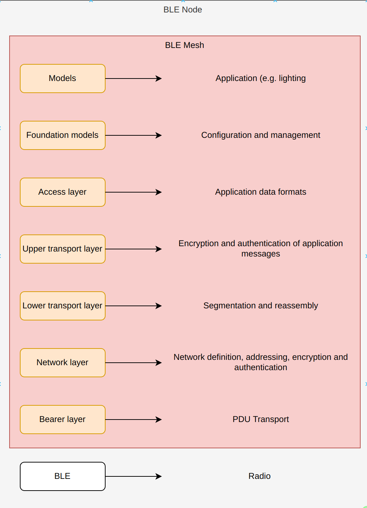
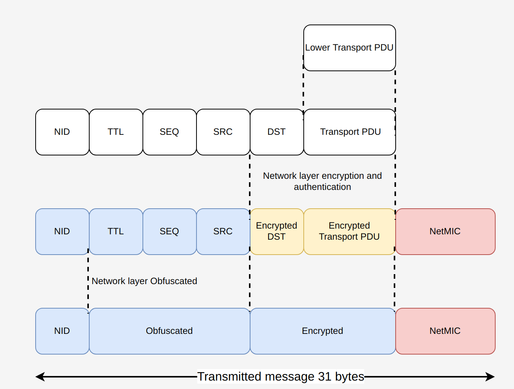
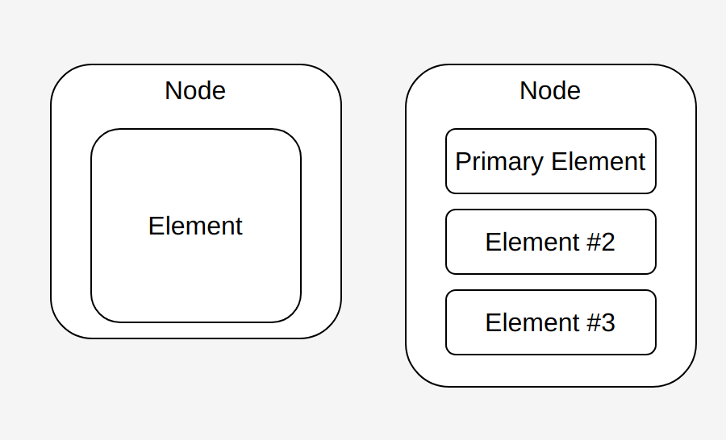
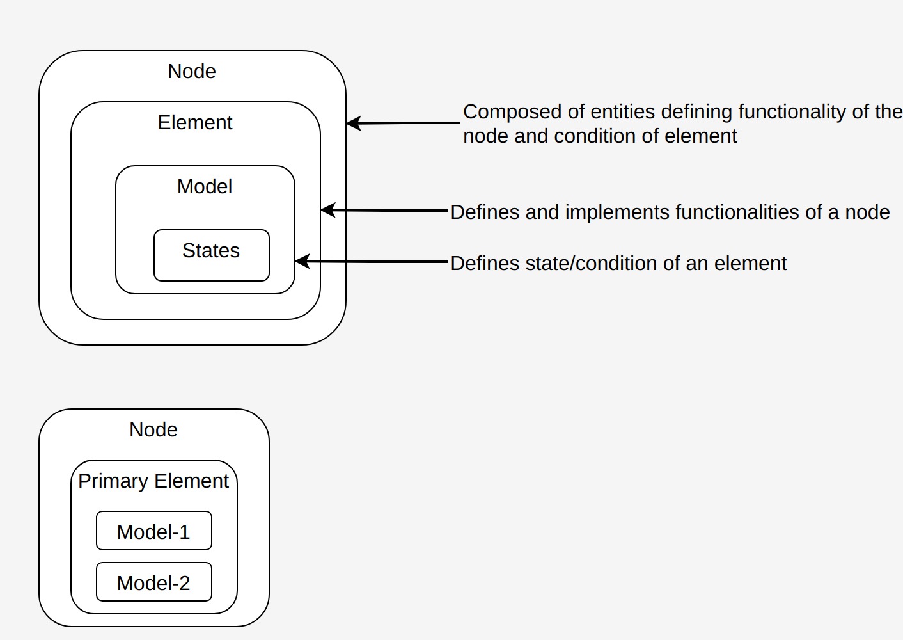
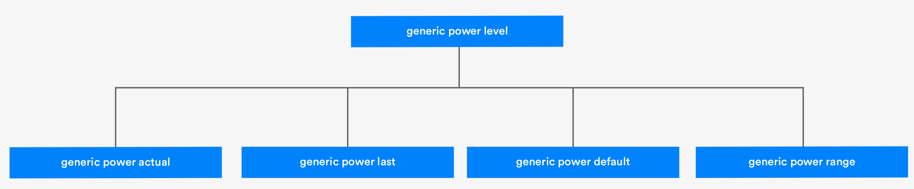
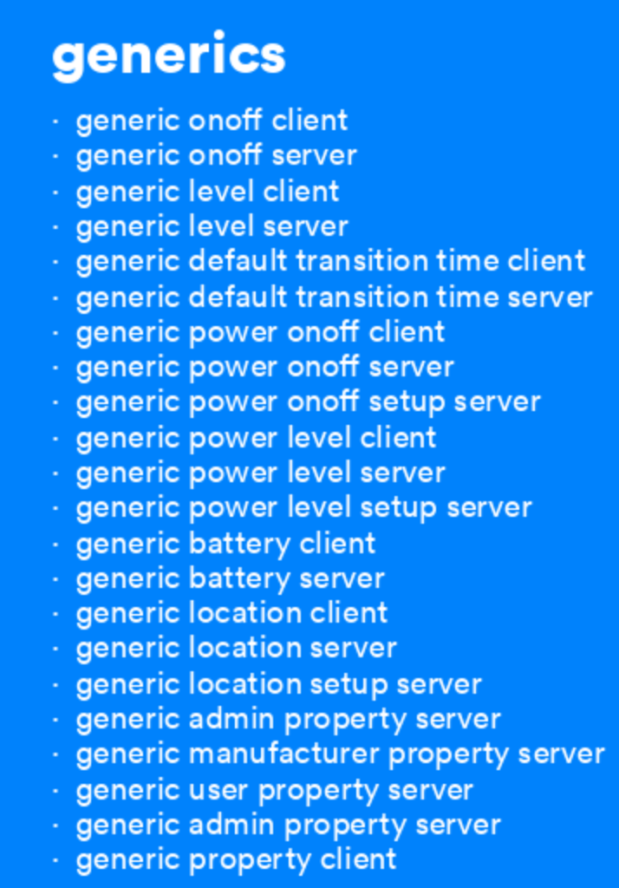

## BLE

### BLE evolution

- Bluetooth Classic: Tradition one-one connection oriented

- BLE Ready: Supports Bluetooth classic and BLE 

- BLE : Bluetooth Low Energy

  - BLE 4.x: Low power Bluetooth communication
    - 4.1: Added Low energy feature
    - 4.2: Enhanced security and MTU (31 bytes). Data rate 2.1Mbps (Mbyte per sec), Indoor range 10 m, 31 bytes Advertise MTU
    
  - BLE 5.x:
    
    - 5: Added 2 new physical layer and Mesh protocol. Data transfer rate 5Mbps (Mbyte per sec), Indoor range 40 m, 255 byte Advertise MTU
    - 5.1 Added direction finding through Angle of Arrival, Angle of Departure
    - 5.2 Added asynchronous channel for audio streaming
    
    |             | Speed | Distance | Released |    Bands     | Backward compatibility | New Hardware requirement |
    | ----------- | :---: | :------: | :------: | :----------: | :--------------------: | :----------------------: |
    | Version 4.1 | 24MBs |   100m   |   2013   | 2.4-2.485GHz |          Yes           |            No            |
    | version 4.2 | 24MBs |   100m   |   2014   | 2.4-2.485GHz |          Yes           |     For some feature     |
    | version 5   | 48MBs |   300m   |   2016   | 2.4-2.485GHz |           No           |           Yes            |
  

## BLEMesh

### System Architecture

In System Architecture,

**Bearer layer** is responsible to received PDU's

**Network layer** is responsible for network definition, addressing, network encryption and authentication. Note network encryption is not same as application encryption.

**Lower transport layer** is responsible for segmentation and reassembly of messages.

**Upper transport layer** is responsible for Application message encryption, authentication

**Access layer** defines application data formats

**Foundation model** is used to configure and management Mesh network.

**Models** are use case specific application running

Note:

- BLE Mesh is NOT new radio. BLE Mesh uses existing BLE Radio.
- BLE Mesh only defines topology
- BLE Mesh is based on broadcasting, there is no point to point connection in BLE Mesh. The reason being management of point to point connection is fairly complexity its difficult to run on low power MCUs.
- A single BLE Mesh is limited to 31 bytes of which 2 bytes are taken by header and remaining 29 bytes are used to convey information in secure encrypted way. BLE never sends a message unencrypted.
- BLE does not have specific routing routes.

Mesh is based on Low Power and supports following features

1. Point to point : GATT bearer for proxy role. GATT connection for legacy devices. Connect phone to a BLE node and configure (add/remove from network)
2. Broadcasting: Advertising and scanning. This is mainly for mesh messages
3. Broadcaster and observer role: Friendship with deciated timing for Tx/Rx windows. This is mainly for sleep low power devices. 

### Features 

**Low power feature**

- Nodes with power constraints want to reduce radio-on time and conserve as much power as possible
- Low-power node (LPNs) work in conjunction with friend nodes

**Friend feature**

- Nodes without power constraints are great candidates for storing incoming messages and updates destined for LPNs

**Relay feature**

- Relay nodes receive and retransmit messages

**Proxy feature**

- Proxy nodes enable transmitting and receiving mesh messages between GATT and Bluetooth mesh nodes

Based on what we need from the node we configure it in above mentioned feature

### Roles

**Low power node** : 

- Low power node operate on battery (typically coin cell) is a node that sleeps for most of the time and wakes-up on event or periodically to receive messages from friend (relay node with friend feature enabled). 

**Friend node**: 

- A non-power constraint device that is kept in ON state all the time. 

**Relay node** 

- A non-power constraint device that is kept in ON state all the time. 
- Relay nodes receive and retransmit mesh messages to all other devices in range. This is called **Managed Flooding**. All packets include a **Time-To-Live** (TTL). A mesh message can hop 127 times at maximum. In order to avoid retransmit of already transmitted messages (**circular flooding**) which can cause huge overhead (network cogging), a **Message Cache** is implemented to recognize already sent message and stop sending same message again and again in the network
-  A relay node can be a friend with Low power node.

**Proxy node**: Its a Relay node that can connect to mobile to configure BLE Mesh network or add/remove devices .

### Security

Security in BLE Mesh protects against various threats and issues, including:

- Replay attacks, which are prevented by judicious use of sequence numbers.
- Man-in-the-middle attacks, which are protected against by using  asymmetrical cryptography, such as the Elliptic Curve Diffie-Hellman  (ECDH) key agreement protocol, during important procedures.
- Trash-can attacks, which exploit discarded devices, by ensuring security keys get refreshed when necessary.

**Network layer**:

Every packet is fully encrypted AES-CCM-128 bit and authenticated. If encryption is key is shared outside. Then outsiders can see the network messages. But since application message is encrypted again with application key. For outsider to fully see/attack need both network key and application key. It must be kept in mind that network key is for a given network so all devices in the network use same network key. By having network key a hacker can pretend to be a relay. Pretending as relay will only help us will not cause any issues.

**Access layer**: Provides two other keys 

- **Application key**: Application key is basis for access control in a BLE Mesh network. Having a application key is equivalent to having access to a model /models of an element. The process binding a application to model is called *Application key binding*. Application key can be set per model in an element basis or can be set across all models of an element.  Prior one is more secured than later approach as if one application key is exposed all data items in all models are exposed. If application key is exposed corresponding model's states can be set or get.
- **Device key**: Device key is pair wise key between a provisioner and device. So that only authenticated provisioner can program the device. This means even if hacker gets application key the hacker can't program device to do something else. But hacker can set or get corresponding model's state (like attacker can turn on-off light bulbs etc)

### Provisioning

Provisioning is the process of adding a new, unprovisioned device to a  Bluetooth mesh network, such as a light bulb. The process is managed by a provisioner. A provisioner and an unprovisioned device follow a fixed  procedure. A provisioner provides the unprovisioned device with provisioning data that allows it to become a Bluetooh mesh *node*. A provisioner is typically a smartphone or other mobile computing  device, running a provisioning application. Although only a single  provisioner is required per network to perform provisioning, multiple  provisioner devices may be used.

Provisioning in BLE Mesh uses Provisioning protocol, which defines PDUs used to communicate between a provisioner and a new, unprovisoned device during the provisioning process. Provisioning protocol supports 2 types of bearer and transport to carry provisioning PDUs. A application use case can use one them to provision Mesh devices.

- Connection-less provisioning use Advertising, this use PB-ADV (provisioning bearer advertisement) bearer.
- Connection oriented provisioning using point to point BLE connection. This uses PB-GATT bearer (provisioning bearer GATT)

#### **Provisioning Bearer**

 A provisioning bearer layer enables the transportation of provisioning  PDUs between a provisioner and an unprovisioned device. Two provisioning bearers are defined:

- **PB-ADV:** A provisioning bearer used to provision a  device over the Bluetooth advertising channels. The PB-ADV bearer is  used for transmitting Generic Provisioning PDUs. A device supporting  PB-ADV should perform passive scanning with a duty cycle as close to  100% as possible in order to avoid missing any incoming Generic  Provisioning PDUs.
- **PB-GATT:** A provisioning bearer used to provision a  device using Bluetooth mesh proxy PDUs from the proxy protocol. The  proxy protocol enables nodes to send and receive network PDUs, mesh  beacons, proxy configuration messages, and provisioning PDUs over a  connection-oriented, Bluetooth Low Energy (LE) bearer. PB-GATT  encapsulates provisioning PDUs within GATT operations, involving the  GATT provisioning service and it is provided for use when a provisioner  does not support PB-ADV.

#### Provisioning protocol

Provisioning protocol defines requirements for provisioning PDUs, behavior, and security.  Understanding the provisioning protocol will help you select an approach to authenticate based on application requirements.  The overall provisioning procedure must accomplish two important tasks at a high level:

1. **Authenticate** the unprovisioned device. In a Bluetooth mesh network,  there may be several, dozens, or hundreds of devices in a small space.  Authentication is performed to make sure that the device the provisioner interacts with is the device the user wants to provision.
2. **Build a secure link** with the unprovisioned device and share  corresponding information with it. At the end of the process, the  unprovisioned device will be a node in the Bluetooth mesh network.

##### Provisioning PDUs

The provisioning protocol defines ten types of provisioning PDU:

1. Provisioning Invite (Provisioner sends)
2. Provisioning Capabilities (device responds)
3. Provisioning State
4. Provisioning Public Key
5. Provisioning Input Complete
6. Provisioning Confirmation
7. Provisioning Random
8. Provisioning Data
9. Provisioning Complete
10. Provisioning Failed

##### Provisioning procedure

The provisioning procedure consists of five phases:

1. Beaconing *(Device yells, provision me !!!)*
2. Invitation *(Provisioner send invitation to unprovisioned device)*
3. Exchange public keys *(Provisioner scan QR code to get public key)*
4. Authentication *(Device authentication using OOB authentication)*
5. Distribution of provisioning data *(Generate network key and other Provision data and send over secure link)*

###### Beaconing

- **For PB-ADV Bearer**:  If an unprovisioned device supports the PB-ADV bearer, it advertises as  an unprovisioned  device beacon. This involves a specified packet format and is used by the unprovisioned device to allow them to be discovered  by a provisioner.

- **For PB-GATT bearer**: when PB-GATT bearer is used by the unprovisioned device, a GATT  service called the Mesh Provisioning Service supports the overall  provisioning procedure and interactions with the provisioner. In the  beaconing phase, the unprovisioned device broadcasts advertising packets that include the UUID of the Mesh Provisioning Service. It is  discovered by the provisioner through the standard Bluetooth Low Energy  scan procedure.

  

###### Invitation

After beaconing, the provisioner and unprovisioned device establish a  provisioning bearer, either PB-ADV or PB-GATT. Then the **provisioner sends a Provisioning Invite PDU** and the **device responds with a  Provisioning Capabilities PDU**.

The Provisioning Invite PDU includes an **Attention Duration field**  which indicates how long the primary element of the unprovisioned device should attract the user’s attention, using some form of visual  indication.

The Provisioning Capabilities PDU includes:

- The number of elements the device supports.
- The set of security algorithms supported.
- The availability of its public key using an Out-of-Band (OOB) technology.
- The ability for this device to output a value to the user.
- The ability for this device to allow a value to be inputed by the user.

**In the provisioning invitation phase, the aim is to provide the  provisioner with information about the unprovisioned device’s  capabilities.**

###### Exchange public keys

In the exchange public keys phase, there are two possible ways for ECDH  public keys to be exchanged. They can be exchanged over a Bluetooth link or through an OOB tunnel. In the provisioning invitation phase, the  unprovisioned device has already reported whether or not it supports  sending its public key via an OOB tunnel. If it does, the provisioner  can proceed to use it and informs the unprovisioned device by sending a  Provisioning Start PDU.

- If the public key of the unprovisioned device is available via an OOB  tunnel, then an ephemeral public key is transmitted from the provisioner to the device, and a static public key is read from the unprovisioned  device using the appropriate OOB technology, such as a QR code.
- If not, both public keys are exchanged over a Bluetooth link

###### Authentication

The provisioner uses the selected authentication method to authenticate (identify if the device is the device user wanted to provision) the unprovisioned device.

**Output OOB (Out Of Band)** : If the Output OOB (Out of Band) authentication method is selected, the  unprovisioned device picks a random number and outputs that number in a  way which is compatible with its capabilities. For example, if the  unprovisioned device is a light bulb, it could blink a given number of  times. If the device has an LCD screen, it could show the random number  as a multiple digit value. The user of the provisioner inputs the number observed to authenticate the unprovisioned device.

**Input OOB**: The Input OOB authentication method is  similar to the Output OOB method, but device roles are reversed. The  provisioner generates a random number, displays it, and then prompts the user to input the random number into the unprovisioned device using an  appropriate action. For instance, a light switch may allow the user to  input the random number by pressing a button an appropriate number of  times within a certain period. 

**Static OOB or No OOB**: In cases where neither Input OOB or  Output OOB are possible, the provisioner and unprovisioned device may use either Static OOB authentication or No OOB authentication. In this  case, the provisioner and unprovisioned device each generate a random number and then proceed to the check confirmation value operation.

No matter which Out Of Band authentication is used. The calculation for authentication need to be done separately in device and provisioner and confirmation value must be checked. The confirmation value from device is called *Confirmation Device* and confirmation value from provisioner is called *Confirmation Provisioner*.

###### Distribution of provisioning data

Once the authentication step has completed, the bearer established  between provisioner and unprovisioned device can be secured for the most important step in the provisioning process:  deriving and distributing  the provisioning data. **The provisioner is responsible for generating the provisioning data**, which consists of a number of items of data,  including a security key known as the **Network Key**. 

Following are list of provisioning data

- Network key: *NetKey* for short. NetKey  secures communication at the network layer and is shared across all  nodes in the network. Possession of a given NetKey is what defines  membership of a given Bluetooth mesh network or subnet. **Equipping a device with a network’s NetKey is one of the primary outcomes of the  provisioning process.** **The provisioner creates the NetKey when provisioning the first device to be added to the network.**
- Device key: A unique security key possessed only by the provisioner and the device being provisioned.
- Key index: NetKeys are too long to be transported in single segment messages. To  make messaging as efficient as possible, keys are allocated a globally  unique 12-bit index value known as the key index, which acts as a short  identifier for the key. Messages include key index values which may be  referenced against key lists maintained by Configuration Clients.
- Flags: Flag bitmask – indicates the status of the associated key.
- IV Index: The IV (Initialization Vector) Index is a 32-bit value which is shared  by all nodes in a network. Its purpose is to provide entropy  (randomness) in the calculation of message nonce values.
- Unicast address: Unicast address of the primary element of the new node.

In order to distribute provisioning data securely, the provisioner uses  AES-CCM to encrypt the provisioning data with a shared SessionKey, which both the provisioner and unprovisioned device calculate. 

### Packet structure for BLE Mesh

Packets in BLE  Mesh is broadcasted. So we can see the

### Publish and Subscribe

**Publishing**:  Devices may send messages to addresses whose names and meaning correspond to high level concept which user can understand like "Garden light".

**Subscribing**: Devices can be configured to receive messages which were sent to particular addresses by other devices.

In short, When a device publishes a message to a particular address, all the other devices that subscribed to the address will receive a copy of it, process it and react in some way.

### Node Composition

#### Element

An Element within a Node must support one or more models, and it is the model or models that define the functionality of that an Element has. One of the first key tasks a mesh firmware developer must undertake is to define their product’s mesh node composition. This means defining in code how many elements the node has and what models each of the elements contains.

Node Composition

- Nodes consist of multiple independent parts called **elements**

- Each node has atleast one element known as the **primary element**

  

**Example** : **Light bulb**

Each Light bulb is a node. Contains one element (so its the primary element). 

- This element has following functionality

  - On/Off

  - Brightness

- Condition of element

  - On or Off

  - 0 - 10 (Brightness level)

The functionality and conditions for the element are described in Models and states

##### Models 

A Model describes functionalities and states. States act on the functionalities (Like variables and functions in c program). 

Model defined by the Bluetooth Special Interest Group (SIG) are called **Bluetooth SIG Models**. It is allowed to define our own models but it is recommended to do so only if its not possible using SIG models. **A model can extend another model** (Inheritance), a process whereby the first model adds states to the second model. Models that do not extend other models are known as ***root models***.

Categories of model

Server Model: 

- Contain states. 
- Some server models are associated with another server model with a name that is similar but includes "SetUp" in it. Example : *Sensor server* is associated with *Sensor setup* *server*
  - ***SetUp server models***: are technically no different to other server models in that they contain a state and produce and consume particular types of messages. Their purpose is to **allow the separation** of a  model’s configuration settings from the main model state items so that distinct access control policies can be applied. For example a network administrator is allowed to configure "SetUp server model" whereas as standard users are not allowed to do so.

Client Model: 

- Client model do not contain states.

When implementing models, it is important to decouple client and server models. That is they know nothing about each other and are like black box to each other. 

##### Extending the model

In the below image is of Light Lightness server and Associated Models. Arrow head indicate base class and arrow point indicate derived class. Here **generic onoff server is base** and **generic power onoff server** is derived from base. In other words, **generic power onoff server extends generic onoff server**. *light lightness setup server* contains all states/properties from the models it extended.

##### Messages

Models talk to each other by sending and receiving messages. The message types are defined as part of specification for each model. This makes it clear regarding what messages a model can produce and consume. Messages either communicate state values or change state value.

A message may be termed a control message or an access message.

- ***Control Messages*** – Messages concerned with the operation of the Bluetooth mesh network. Examples include heartbeat and friend request messages. 
- ***Access Messages*** – Allow client models to retrieve or set  the value of state values in server models, or they are used to report  state values by the server. 

**Models** implement and define the **functionality** of nodes. **Elements** are  **uniquely addressable entities** within nodes containing one or more models and **states define the status of elements**. For every state, there is set of messages that a server model supports. **Messages are identified by** **opcodes** and have associated parameters. An opcode identifies the operation of the message. Parameter defines the value passed to these message. This is kind relation between function (message opcode) and function parameter(message parameter) in C programming language.

There are two categories of access message, **acknowledged** and  **unacknowledged**. Acknowledged messages are transmitted to and  acknowledged by each receiving element. The response is typically a  status message. No response is sent to an unacknowledged message.  Bluetooth mesh network status messages are an example of unacknowledged  messages. 

###### Message Exchange

Bluetooth mesh networking uses a  publish/subscribe model for message transport. Nodes generating messages are said to publish messages. Nodes interested in receiving messages  subscribe to addresses they are interested in. Messages may be published to unicast, group, or virtual addresses. 

- **Publishing message**: **Every model in a node has a single publish  address.** Publish address indicates is like a topic in MQTT (except its an address format not string). When  **sending message**, it uses the **model’s publish address** as  the **destination address**. 

- **Receiving message**: When receiving messages, each instance of a model within a node may subscribe to receive messages from one or more group or virtual addresses. Models subscribing to messages use a model’s subscription lists to  define valid addresses that they can receive messages from. When  messages are received by a model, the model checks its subscription  list. It’s considered a match when the address on the subscription list is set to the model’s element unicast address or a group address  that belongs to the node.

  Messages received by a model either 

  - **Set**: change a state value. This comes in 2 flavours
    - set messages which require ACK: In this new value of state is sent back in a status message
    - set messages which dont require ACK
  - **Get**: request that the current value of particular state be reported in a status message 

Each model in an element with have one publish address so that other elements in same or other node can publish message to it. Also each model can subscribe to many address (group or virtual address) to receive messages published by other elements in same or other node.

**Reply message**: Messages may be sent as replies to other messages. When a model sends a **reply message**, it uses the  message **originator’s source address as the destination address**. 

| Address type       | Valid source address | Valid destination address for access messages |
| ------------------ | -------------------- | --------------------------------------------- |
| Unassigned address | No                   | No                                            |
| Unicast address    | Yes                  | Yes                                           |
| Virtual address    | Yes                  | Yes                                           |
| Group address      | Yes                  | Yes                                           |

When receiving messages, each instance of a model within a node (there  may be multiple models in a node) may subscribe to receive messages from one or more group or virtual addresses. 

 Models consists of  data items categorized into following

- states
- properties

###### States

States are data items in Model that indicate the condition of the device, such as on/off or high/low. States can contain a **single value** or **composite**, containing multiple fields, similar to a struct in programming language like C. States always belong to a model and are interpret within the context of that model. In below image *generic power level* is a composite state. It is composed of following single value states 

- generic power actual
- generic power last
- generic power default
- generic power range

###### State binding

A state binding indicates that if one of the states in the relationship changes, then the other one needs to have its value recalculated. There is interdependencies between the states and thus there is a binding. If state bindings are not explicitly specified the states are independent to each other.

<u>*Example for state binding*</u>

 For example, if the generic on/off state indicates that a device is currently off, increasing the generic level state should have no user-discernible effect. 
Switching the device on by setting the generic on/off state to 1 should not only switch the device on, but it should begin functioning at the level that has been set. This shows that level state depends on on/off state. Level state is set only if device is in ON state.

###### Properties

Properties are the data items in a Model. Properties are instances of characteristics used in GATT. A characteristic defines the fields its value consists of. Characteristics are members of services and the service that owns a characteristic provides a context within which characteristics is interpreted and use.

Example: ***Temperature 8 characteristic*** is a type which represents temperature measurement and has format *uint8* and uses units of *0.5 degree Celsius.* This characteristic can be used as **Present Indoor Ambient Temperature** property indicating indoor ambient temperature measurement. The same temperature 8 characteristic can be used as **Present Outdoor Ambient Temperature** property indicating outdoor ambient temperature measurement. Thus if we look at above Temperature 8 Characteristic itself is NOT associated with location(Indoor or Outdoor) but is interpreted on location derived from **Location properties**.

###### Difference between state and property 

**Properties differ from states in that they contain both an *identifier* and *a* *value*. The identifier tells us what type of data the property contains so that it is self-describing. States, on the other hand, have no explicit type identifier, and it is the model or message the state is contained within that tells us the data’s state.** 

In a model state will have fixed interpretation and are NOT left to application cases. Whereas as interpretation of property may vary based on application making same model used across wide variety of application cases. Basically state have rigid interpretation within a model so that cannot be adapted for wide application cases contrary to properties which provide flexible, application case specific interpretation. Properties reduces the requirement of having large number of states to cover wide variety of application cases. We can use states only for data items which are common across all application cases and use property for data items that are specific to application cases.

### Steps for creating BLE Mesh Node

1. Define node composition
2. Implement RX message function handler
3. Register/bind RX message handler function for appropriate message 
   - The opcodes of messages associated with each model and which the node might receive (RX) must be registered and, one or more functions for handling those message types, implemented
4. Implement TX message handlers to send messages based on application specific events device interaction

  

### Overview of Mesh Models

Mesh Models are classified into 2 groups

**Foundation Mesh models**

Foundation models are concerned with enabling the configuration and management of the BLE mesh network and devices it contains. There are 2 sets of foundation mesh models

- **Configuration Server and Client Models**: Models concerned with configuring a device node
  - Configuration server model: This is mandatory as all devices are configurable in BLE Mesh network. This model provides the device with the ability to be configured using a smart phone or other device having Configuration client model. In Configuration server model device's overall composition is held within a state called Composition Data state. In configuration server model we can set role the device takes like relay, proxy, friend, low power node, destination address to use when publishing messages, the addresses subscribed to etc. 
  - Configuration client model: This is required to configure Configuration server model. Client model is typically implemented in smart phone.
- **Health Server and Client Models**: Models concerned with fault reporting and diagnostics. 
  - Health Server: This is mandatory in all BLE mesh nodes. This serves as primary element as all other elements within the node inform faults to health server.  Health server defines series of fault related states and each faults are represented by 8 bits code.
  - Health client: This is required to get fault reports for diagnostics from health server model.

**Application Mesh Models**

Application models are chosen basis and are optional for a node. Application  models can be categorized into 4 groups

- Generics
- Sensors
- Time and Scenes (Mesh automation)
- Lighting

Generics: Generics collection of Bluetooth mesh models designed to be used by kind of device. There are 22 generic models and related 8 states.

##### Generic onoff model

Generic onoff models make it possible for one device to switch other devices on or off 

Generic onoff server: Contains one state of boolean type. This indicates ON (if value is 0x01), OFF (if value is 0x00). 

This model support following messages

- generic onoff get
- generic onoff set acknoweldge
- generic onoff set unacknoweldge 

##### Generic level model

The generic level model contains one state of signed 16 bit integer type. This indicates level between -32767 to 32767 (both inclusive). Typically application is to indicate temperature of a room, brightness level of a lamp, rotary position etc.

This model supports following messages

- generic level set : changes the generic level state to an absolute value 

- generic delta set: changes the generic level state by a relative positive or negative count.

- generic move set : initiates changing the generic level state in either a positive or negative direction and at a given speed. (Direction and speed)

  For generic move, speed with which the transition takes place is calculated from *delta level field* (optional) in the move message. If delta level field is not present in message then speed is deduced from state *generic default transition time* (optionally present). If both *delta level field* in message and state *generic default transition time* are absent. The state *generic level* is not set. Move transition may continue indefinitely. It will stop if move set message with delta level field set to zero is received. Also we limit state *generic level* to a range of value, this is application specific implemented in firmware.

Each of the generic level set, generic delta set,generic move set support the optional field delay and transition time.

- delay field: This allows the client to inform the server to defer execution of operation for a period of time after receiving the message
- transition time: speed with which transition should take place. This is encoded with two data items
  - Default transition Number of steps: 6 bits: Number of steps
  - Default transition step resolution: 2 bits: time resolution of each transition step in the field. This can take 4 values 
    - 0b00 : 100ms
    - 0b01: 1 second
    - 0b10: 10 seconds
    - 0b11: 10 min

##### Generic Power onoff client

These models enable the initial state that a device is in immediately after powering up to be configured. The generic power onoff server model has a single state, generic on powerup which has three values defined with meanings.

| Value      | Description                                                  |
| ---------- | :----------------------------------------------------------- |
| 0x00       | Off. After being powered up, the element is in an off state. |
| 0x01       | Default. After being powered up the element is in ON state and uses default state values |
| 0x02       | Restore. If a transition was in progress when powered on, the element restores the target state when powered up.  Otherwise, the element restores the state it was in when powered down. |
| 0x03- 0xFF | Prohibited.                                                  |

##### Sensor Client, Server and setup models

These models provide a generalized approach to sensor operation in a Bluetooth mesh network and allow any type of sensor to communicate sensor readings to other nodes in the network. The sensor setup server allows the sensor and format of its data to be configured.

Leveraging properties has allowed the three sensor models to accommodate any type of sensor and sensor data, rather than requiring different models, messages, and states for each conceivable type of sensor that might be part of a network.

In the figure, Sensor client interacts with Sensor Setup Server and Sensor Server via messages. Sensor Server (derived) extends Sensor Setup Server (base). 

###### Sensor States

Sensor models are defined around a single composite state called *Sensor state*. *Sensor state* consists of data items that are distributed across two models Sensor server model and Sensor Setup Server model. The sensor data state contains an **array of property ID / raw value pairs**. Referenced property in sensor data contains either simple value or array of values. If reference property contains a simple value, we can get simple value using **sensor get** which returns the value of referenced property in sensor data state in **sensor status message**. If reference property contains array of values, then we can get array of values using **sensor get** which returns the value of referenced property in sensor data state in **sensor column status message**.

###### Sensor Descriptor

The sensor descriptor state contains information that describes the sensor data available from this sensor. Values in sensor descriptor state is expected not to change over entire lifetime of the sensor. Following are the contents of the sensor descriptor state

- Sensor property ID: ID of the property to which sensor description belongs

- Sensor positive tolerance and Sensor negative tolerance: The tolerance fields provide an indication of the magnitude of possible errors in measurements reported by the sensor. 
- Sensor sampling function: The sensor sampling function field indicates the type of function applied to measured sensor values.
- Sensor measurement period: The sensor measurement period field indicates the time period over which measurements are being averaged.
- Sensor Update Interval: The sensor update interval indicates the frequency with which each measurement is made by the sensor.

###### Sensor Setting State

The sensor setting state contains **a list of such settings and their values**. Each member of the list consists of the 

- Sensor property ID: ID of the property to which the setting belongs. 
- Sensor Setting property ID: ID of a property that identifies the setting. 
- Sensor setting access: an indication of whether the setting is read only or may also be written 
- Sensor setting raw: raw setting value.

###### Sensor Cadence State

The sensor cadence state allows the frequency with which a sensor publishes status reports relating to each sensor data type (identified by property ID) to be configured. The rate of publication can be configured to vary according to various conditions. When the value falls within a configured range, the publication rate can be increased. If particularly large increases or decreases in the sensor data value are measured, the reporting rate can also be increased. In each case, the fast cadence period divisor indicates by how much the rate of publication should be increased when any of these circumstances arise.

### Mesh addressing

There are 4 types of addresses of which 3 types are used for messaging. Each of the address is 16-bits in length and are encoded	

| Values in bit wise representation (16-bits) | Address Type       | Messaging |
| ------------------------------------------- | ------------------ | --------- |
| 0x0000                                      | Unassigned address | No        |
| 0x0001 to 0x7FFF                            | Unicast address    | Yes       |
| 0x8000 to 0xBFFF                            | Virtual address    | Yes       |
| 0xC000 to 0xFFFF                            | Group address      | Yes       |

<u>**Non-messaging addresses**</u>

- **Unassigned address**: **Unconfigured elements, or elements without designated addresses**, have an unassigned address. Given these elements do not have a unique address,  they may not be used in messaging.

<u>**Messaging addresses**</u>

- **Unicast address**: **Uniquely identifies a single element in the mesh.** During provisioning, a provisioner allocates a unicast address to each  element in a node for the lifetime of that node on the network. Unicast  addresses may appear in the source address field and/or the destination  address field of a message. Messages sent to unicast addresses are only  processed by one element.
- **Virtual address**: An address that can be associated with multiple elements that may come from one or more nodes. Virtual address provides logical grouping of elements spanning in one or more nodes. For this a 128-bit Label UUID is introduced. This provide large set of addresses for logical grouping. Even through label UUID is 128-bit long. Checking the full 128-bit UUID with a subscribing element is inefficient, especially as  the UUID may span more than one message segment. Thus virtual address are introduced, virtual address are 16-bit long with, bits 15 and 14 are set to 1 and 0 respectively  and bits 13 – 0 are set to a hash value (providing 16,384 hash  values). The hash is derived from the Label UUID. Thus, Virtual addresses are derived derived from a 128-bit Label UUID. Virtual addresses are a set of elements associated with a specific Label UUID; these addresses may be published or subscribed to.  Typically, The intent is the UUID  can be preset by a manufacturer to allow them to address their product  globally.
- **Group address**: Group addresses are multicast address representing multiple elements from one or more nodes These are either predefined by the Bluetooth SID as SIG fixed  group addresses or assigned on the fly.   
  - ​	Dynamically assigned: 0xC000 to 0xFEFF
  - ​	Fixed addresses: Assigned by Bluetooth SIG

    - *Reserved for Future Use (RFU)*: [Address 0xFF00-0xFFFB]
    - *All-proxies* : [Address 0xFFFC]
      - Sent to all nodes with proxy functionality enabled.
    - All-friends: [Address 0xFFFD]
      - Sent to all nodes with friend functionality enabled.
    - All-relays: [Address 0xFFFE]
      - Sent to all nodes with relay functionality enabled.
    - All-nodes: [Address 0xFFFF]
      - Sent to all nodes.
  - All messages sent to fixed nodes are processed by the primary element of the node. 